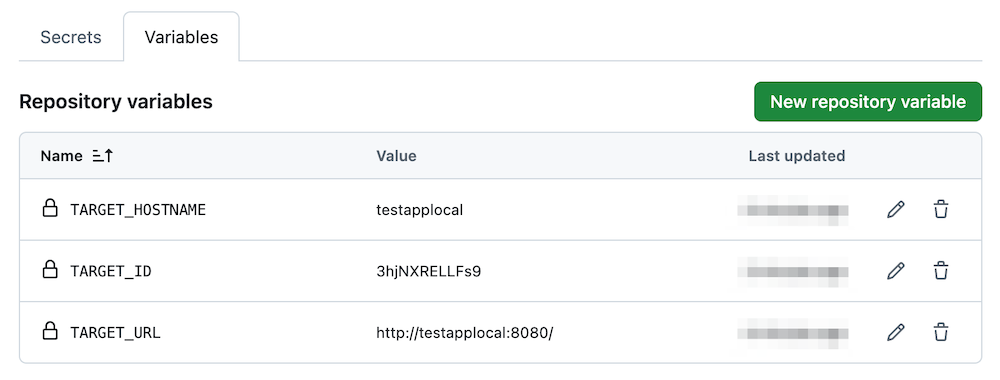
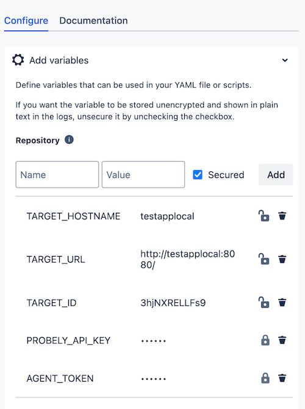

# CI/CD pipeline scan examples (GitHub actions, BitBucket, and more)

## Integrations

- All examples use Probely's CLI
  - https://developers.probely.com/cli/overview-cli-documentation/

## Common actions

### Running a scan on an ephemeral application

- Create the **target** on Probely with the desired internal hostname (ex: `http://testapplocal:8080/`)
  - https://help.probely.com/en/articles/5733114-how-to-add-a-target
- Create an **API Key** on Probely with the right permissions to start a scan on this target
  - https://help.probely.com/en/articles/8592281-how-to-generate-an-api-key
- Create a **Scanning Agent** on Probely and configure the target to use the scanning agent
  - (Step 1) https://help.probely.com/en/articles/6503388-how-to-install-a-scanning-agent
  - https://help.probely.com/en/articles/4615595-how-to-scan-internal-applications-with-a-scanning-agent

### Running a scan on a remote target (target running on your server) in blocking and non-blocking mode

- Create the **target** on Probely 
  - https://help.probely.com/en/articles/5733114-how-to-add-a-target
- Create an **API Key** on Probely with the right permissions to start a scan on this target
  - https://help.probely.com/en/articles/8592281-how-to-generate-an-api-key

### NOTE: You can use the app provided in this repo to test the integration.

----

## GitHub Actions

Create a GitHub action using the following YAML examples:

### Running a scan on an **ephemeral** application in **blocking mode**

  - [YAML file](./cicd-examples/github/github-ephemeral-app-blocking-mode.yaml)
  - Configuration
    - 
    - 

### Running a scan on a **remote** target in **blocking mode**

  - [YAML file](./cicd-examples/github/github-remote-app-blocking-mode.yaml)
  - Configuration
    - 
    - 

### Running a scan on a **remote** target in **non-blocking mode**

  - [YAML file](./cicd-examples/github/github-remote-app-non-blocking-mode.yaml)
  - Configuration
    - 
    - 

----

## BitBucket

Create a `bitbucket-pipelines.yml` file using the following YAML examples:

### Running a scan on an **ephemeral** application in **blocking mode** (requires the `scanning-agent/farcasterd-linux-amd64-0.4.3` file)

  - [YAML file](./cicd-examples/bitbucket/bitbucket-ephemeral-app-blocking-mode.yaml)
  - Configuration:
    - 

### Running a scan on a **remote** target in **blocking mode**
  - [YAML file](./cicd-examples/bitbucket/bitbucket-remote-app-blocking-mode.yaml)
  - Configuration
    - 

### Running a scan on a **remote** target in **non-blocking mode**
  - [YAML file](./cicd-examples/bitbucket/bitbucket-remote-app-non-blocking-mode.yaml)
  - Configuration
    - 

---- 